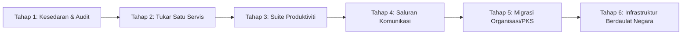

# Panduan Migrasi: Laluan 6-Tahap Keluar Dari Big Tech
## "Exit Big Tech" Step-by-Step Migration Roadmap

Kempen ini menolak pendekatan drastik yang menuntut masyarakat memadam semua akaun dalam tempoh 24 jam. Tindakan yang tidak realistik hanya menimbulkan keputusasaan dan penolakan.

Sebaliknya, kami merangka **Laluan 6-Tahap Berperingkat (*6-Level Progressive Path*)** yang praktikal, mampan, dan boleh dilaksanakan oleh individu, keluarga, syarikat PKS, serta agensi awam.

---

---

## Tahap 1: Kesedaran & Audit Digital (Hari 1 – 7)
**Matlamat:** Mengetahui sejauh mana kehidupan atau perniagaan anda terikat dengan monopoli 4 gergasi teknologi (Google, Amazon, Microsoft, Meta).

### Tindakan Praktikal:
1. **Lakukan Inventori Digital:**
   * Senaraikan perkhidmatan yang anda gunakan setiap hari: Di mana e-mel anda dihoskan? Di mana gambar keluarga anda disimpan? Apakah pelayar web anda? Apakah sistem pemesejan utama anda?
2. **Ketahui Hak Data Anda:**
   * Muat turun sandaran arkib data anda menggunakan ciri eksport rasmi (Google Takeout, Microsoft Privacy Dashboard, Meta Export Data) dan simpan salinan tersebut dalam cakera keras luar (*external hard drive*).
3. **Kefahaman Etika:**
   * Fahami kaitan antara langganan awan harian anda dengan kontrak pertahanan seperti Project Nimbus dan sekatan kebebasan bersuara.

---

## Tahap 2: Gantikan Satu Perkhidmatan Mudah (Minggu 2 – 4)
**Matlamat:** Memecahkan mitos bahawa perkhidmatan Big Tech "tiada pengganti".

### Tindakan Praktikal:
1. **Tukar Pelayar Web (*Web Browser*):**
   * Beralih dari Google Chrome ke **Mozilla Firefox** atau **Brave**. Pasang pemalam privasi seperti *uBlock Origin*.
2. **Tukar Enjin Carian:**
   * Jadikan **SearXNG** atau **DuckDuckGo** sebagai carian lalai anda. Rasai pengalaman mencari maklumat tanpa profiling pengiklanan peribadi.
3. **Mula Menggunakan Signal:**
   * Pasang aplikasi **Signal** dan jemput 3–5 ahli keluarga terdekat atau rakan sekerja rapat untuk mula bersembang di sana bagi mengurangkan kebergantungan kepada WhatsApp.

---

## Tahap 3: Gantikan Suite Produktiviti & Storan Fail (Bulan 2 – 3)
**Matlamat:** Membebaskan dokumen, kertas kerja, dan arkib peribadi daripada simpanan awan proprietari.

### Tindakan Praktikal:
1. **Beralih Kepada LibreOffice:**
   * Pasang **LibreOffice** di komputer peribadi. Mula menyimpan dokumen dalam format piawai terbuka `.odt` dan `.ods`. Simpan fail secara tempatan dan eksport kepada PDF apabila perlu dihantar kepada pihak luar.
2. **Storan Peribadi / Cloud Bebas:**
   * Pindahkan arkib fail dan foto penting daripada Google Drive/OneDrive kepada storan **Nextcloud** (sama ada melanggan hos Nextcloud yang beretika, atau menggunakan pemacu NAS tempatan di rumah).
3. **E-mel Bebas Pengiklanan:**
   * Buka akaun e-mel pada penyedia privasi bebas (seperti Proton Mail, Tuta, atau domain sendiri) dan mula alihkan pendaftaran perbankan dan akaun penting ke alamat baharu tersebut.

---

## Tahap 4: Penggantian Saluran Komunikasi & Media (Bulan 3 – 6)
**Matlamat:** Mengurangkan kebergantungan kepada platform pemesejan dan media sosial tertutup.

### Tindakan Praktikal:
1. **Komunikasi Komuniti / Organisasi:**
   * Pindahkan kumpulan kerja komuniti atau kelab aktivisme dari WhatsApp ke **Element / Matrix** atau **Zulip**.
2. **Sidang Video Bebas:**
   * Gantikan Google Meet dan Zoom dengan **Jitsi Meet** (`meet.jit.si`). Pautan boleh dibuka serta-merta tanpa perlu memasang aplikasi berat atau mendaftar akaun.
3. **Menjelajah Media Sosial Persekutuan (*The Fediverse*):**
   * Buka akaun di **Mastodon** untuk perkongsian mikro-blog dan **PeerTube** untuk kandungan video. Pelajari bagaimana sistem tanpa algoritma keuntungan komersial berfungsi.

---

## Tahap 5: Migrasi Organisasi, NGO & Syarikat PKS (Bulan 6 – 12)
**Matlamat:** Membina daya tahan operasi perniagaan tanpa bayaran per-kepala USD kepada gergasi teknologi.

### Tindakan Praktikal:
1. **Melaksanakan Pelayan E-mel Berdaulat:**
   * Pasang pelayan **Mailcow** di pelayan maya (VPS) milik penyedia tempatan (TM One / Exabytes / Casbay). Kos tetap bulanan sekitar RM100–RM200 boleh menampung 50–100 kakitangan syarikat, menjimatkan puluhan ribu ringgit setahun berbanding Google Workspace.
2. **Pelaksanaan Nextcloud Hub Korporat:**
   * Wujudkan portal kolaborasi dalaman berasaskan Nextcloud dengan OnlyOffice. Kakitangan boleh menyunting dokumen secara serentak dalam pelayar web tanpa sebarang data dihantar ke California.
3. **Penggunaan AI Tempatan (*On-Premises LLMs*):**
   * Pasang **Ollama** di komputer kerja untuk staf memproses, meringkas, dan menterjemah dokumen syarikat tanpa melanggar Akta Perlindungan Data Peribadi 2010 (PDPA) atau membocorkan rahsia perdagangan.

---

## Tahap 6: Infrastruktur Digital Berdaulat Peringkat Nasional
**Matlamat:** Autonomi teknologi strategik untuk universiti, agensi kerajaan, dan prasarana kritikal Malaysia.

### Tindakan Praktikal:
1. **Dasar Perolehan Berorientasikan Sumber Terbuka (*FOSS Procurement Mandate*):**
   * Menghidupkan semula garis panduan MAMPU yang mewajibkan penilaian perisian sumber terbuka sebelum sebarang lesen perisian monopoli asing boleh diluluskan.
2. **Pembangunan Awan Peribadi Kerajaan Sebenar (*True Sovereign GovCloud*):**
   * Membina kluster pengkomputeran berasaskan **OpenStack, Proxmox, dan Kubernetes** di pusat data fizikal milik agensi tempatan, memastikan pengurusan kunci kriptografi kekal 100% di tangan penjawat awam Malaysia.
3. **Pendidikan & Kurikulum Kebangsaan Bebas Vendor:**
   * Memperkenalkan sistem operasi Linux dan alat pengaturcaraan terbuka di sekolah dan universiti awam, melahirkan generasi jurutera perisian yang merdeka dan berkemahiran tinggi.
