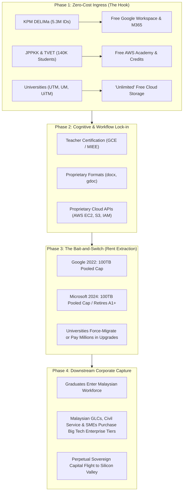

# The Free-to-Lock-In Pipeline: How Big Tech Seeds Educational Ecosystems in Malaysia

**An Investigative Research Report on Platform Colonialism, Vendor Lock-in, and Sovereign Data Enclosure Across K-12, TVET, and Higher Education**

---

## Executive Summary

Over the past decade and a half, Malaysia’s national education landscape has undergone an aggressive digital transformation. What began in 2011 as a domestic public-private partnership under the ill-fated **RM4.1 billion 1BestariNet** initiative has evolved into an entrenched, multi-tiered oligopoly dominated by three American hyperscalers: **Google**, **Microsoft**, and **Amazon Web Services (AWS)**.

Under the banner of "digital inclusion," "bridging the digital divide," and "corporate philanthropy," these technology conglomerates have implemented what political economists and software theorists define as **The Free-to-Lock-In Pipeline**. By offering subsidized software licenses, "free" cloud storage, proprietary certification pathways, and ready-made learning management portals, Big Tech has established structural dependencies at every stage of Malaysia's educational hierarchy:

1. **Primary & Secondary (K-12):** 5.3 million user IDs registered on the Ministry of Education's (**MOE / KPM**) **DELIMa** portal, conditioning students from age 7 to operate exclusively within Google Workspace and Microsoft 365.
2. **Vocational & Technical (TVET):** Over 140,000 polytechnic and community college students under **JPPKK** funneled into proprietary AWS Cloud and AI curricula, with state learning management systems hosted on AWS infrastructure.
3. **Higher Education (Public & Private Universities):** Public research universities (UTM, UM, UKM, UiTM, USM) trapped between Google and Microsoft bait-and-switch storage caps, forcing either painful data triage or millions in recurring foreign currency software licensing.
4. **The Workforce Conversion:** Millions of graduates entering Malaysian Government-Linked Companies (GLCs), civil service departments, and SMEs with cognitive "muscle memory" wired strictly for Big Tech interfaces, guaranteeing perpetual commercial enterprise rent extraction.

Crucially, this ecosystem operates in a legal and regulatory vacuum: **Section 3(1) of the Personal Data Protection Act 2010 (PDPA)** exempts the Federal and State Governments from statutory data protection compliance, leaving millions of minors' digital educational footprints governed primarily by foreign end-user licensing agreements (EULAs) and vulnerable to extra-territorial data seizure under the **US CLOUD Act**.



---

## 1. Historical Genesis: From 1BestariNet to Global Hyperscalers

### The 1BestariNet Failure (2011–2019)
The groundwork for Big Tech’s total capture of Malaysian classrooms was laid by the catastrophic failure of the **1BestariNet project**. Initiated in 2011 by the Ministry of Education under YTL Communications, the 15-year, three-phase project was budgeted at **over RM4.07 billion** to equip 10,000 public schools with high-speed 4G connectivity and a Virtual Learning Environment (**Frog VLE**).

Repeated investigations by the **Auditor-General (Laporan Ketua Audit Negara 2013, 2018)** and the **Public Accounts Committee (PAC)** revealed stark realities:
- **Severe Underutilization:** Less than 5% of students and teachers actively used Frog VLE; in many rural schools, daily active usage hovered below 1%.
- **Bandwidth Deficits:** High-speed internet promises were bottlenecked by proprietary hardware, high latency, and absent coverage in rural Sabah and Sarawak.
- **Contractual Rigidity:** The state was locked into leasing agreements and telecommunication tower sites on school grounds that offered little technical agility.

### The 2019 Pivot: Jumping from a Domestic Monopoly into an American Oligopoly
When the Pakatan Harapan administration took office, then-Education Minister Dr. Maszlee Malik announced in June 2019 that the MOE would not renew YTL's 1BestariNet contract upon its expiry on June 30, 2019. 

In a bid to demonstrate fiscal prudence and modernize overnight, the Ministry opted to terminate Frog VLE and replace it with **Google Classroom**, alongside commercial telco interim contracts (Celcom, Maxis, TM). While this transition was celebrated as a victory against domestic crony capitalism and a massive cost-saving measure (saving tens of millions in annual software fees), it fundamentally misdiagnosed the strategic danger: **it replaced a domestic proprietary contractor with global platform monopolies whose market capitalization and geopolitical reach dwarfed national sovereignty.**

---

## 2. The K-12 Enclosure: DELIMa and the Google-Microsoft Duopoly

### The Architecture of DELIMa
In June 2020, during the height of national COVID-19 school closures, the MOE officially launched **DELIMa** (*Digital Educational Learning Initiative Malaysia*). Marketed as an independent, homegrown national digital education portal, DELIMa is architecturally an aggregator and identity federation bridge connecting directly to three foreign tech giants: **Google**, **Microsoft**, and **Apple**.

```
                           +-------------------------------------+
                           |            KPM DELIMa Portal        |
                           |   (5.3 Million Registered Users)    |
                           +------------------+------------------+
                                              |
                     +------------------------+------------------------+
                     |                        |                        |
           +---------v---------+    +---------v---------+    +---------v---------+
           |  Google Workspace |    |   Microsoft 365   |    |    Apple Teacher  |
           |   for Education   |    |   for Education   |    |   Learning Center |
           +-------------------+    +-------------------+    +-------------------+
           | - Google Classroom|    | - MS Teams        |    | - Swift / iPad    |
           | - Google Meet     |    | - Office Apps     |    | - Apple IDs       |
           | - Gemini Academy  |    | - AI Toolkit      |    |                   |
           | - @moe-dl.edu.my  |    | - Reading Coach   |    |                   |
           +-------------------+    +-------------------+    +-------------------+
```

### Scale of Deployment
Official MOE figures demonstrate near-total penetration into the Malaysian public school system:
- **Total User Accounts:** ~**5.3 million** provisioned accounts under the `@moe-dl.edu.my` domain.
- **Teacher Penetration:** Over **401,000 to 420,000 teachers** (99.5% of the national teaching workforce) actively enrolled and authenticated.
- **Student Engagement:** Over **4.1 million primary and secondary school pupils** issued digital IDs, logging homework, assignments, and attendance through Google Classroom and Microsoft Teams.
- **Curricular Assets:** 788 national school textbooks digitized into proprietary portal viewing environments, flanked by thousands of educational videos.

### The Mechanics of Cognitive Lock-In
The pipeline does not merely extract software fees; it shapes cognitive architecture:
1. **The Identity Leash (`@moe-dl.edu.my`):** From Standard 1 (age 7), a Malaysian child’s first official digital identity is not a sovereign national cryptographic key or open protocol account; it is a Google-federated educational tenant.
2. **Proprietary Workflow Conditioning:** Homework is distributed as Google Docs; math presentations are assigned in Google Slides or Microsoft PowerPoint; group discussions occur via Microsoft Teams or Google Meet. Open standards (such as OpenDocument formats `.odt`, `.ods`, `.odp` or open-source platforms like Moodle and Nextcloud) are entirely excluded from the default pedagogical experience.
3. **Teacher "Evangelist" Certification Funnels:** Tech giants instituted gamified, credentialed professional development pathways:
   - **Google Certified Educator (GCE Level 1, Level 2, Trainer)**
   - **Microsoft Innovative Educator Expert (MIEE)**
   - **Apple Distinguished Educator (ADE)**
   
   Malaysian educators, incentivized by annual performance evaluation metrics (SKT/PBPPP) and district-level (PPD) recognition, dedicate personal hours to mastering proprietary commercial feature sets. Public school teachers effectively become unsalaried brand ambassadors and platform onboarding agents for multinational corporations.

---

## 3. Higher Education & TVET: AWS and the Cloud Hegemony

While Google and Microsoft dominate the K-12 operational landscape, **Amazon Web Services (AWS)** has executed a targeted capture of Malaysia’s tertiary, technical, and vocational education systems.

### JPPKK: Standardizing 140,000 TVET Students on AWS
In September 2024, the **Department of Polytechnic and Community College Education (JPPKK)** under the Ministry of Higher Education (**MOHE / KPT**) signed an agreement establishing JPPKK as an **AWS Authorized Training Partner**.
- **Reach:** Over **140,000 students** across 36 polytechnics and 105 community colleges nationwide.
- **Curricular Enclosure:** TVET cloud computing, networking, and artificial intelligence syllabi have been rebuilt around the AWS Academy curriculum.
- **Infrastructure Ingestion:** JPPKK migrated **CIDOS** (*Centralized Information Document Online System*), the national polytechnic learning management system, directly onto AWS cloud hosting. The state now pays Amazon to host the platform on which it trains students to use Amazon’s commercial cloud.

### University Standardisation: AWS Academy & CendekiAwan
Across Malaysian research and comprehensive universities:
- **49 Universities** actively run **AWS Academy** courses as accredited modules in Computer Science and Software Engineering degree programs (e.g., Universiti Teknologi Malaysia [UTM], Asia Pacific University [APU], Tunku Abdul Rahman University of Management and Technology [TAR UMT]).
- **CendekiAwan Malaysia (November 2025):** Launched in partnership with 11 public universities—including Universiti Teknologi MARA (UiTM), Universiti Malaysia Perlis (UniMAP), and Universiti Tun Hussein Onn Malaysia (UTHM)—to train 20,000 students exclusively on AWS cloud and generative AI workflows.
- **Skills to Jobs Tech Alliance (October 2024):** Co-sponsored by the Malaysia Digital Economy Corporation (MDEC) and AWS, ensuring that university course accreditations directly map to AWS proprietary certification exams (Cloud Practitioner, Solutions Architect, SysOps).

### The Epistemological Distortion of Computer Science Education
The integration of AWS Academy distorts foundational computer science education:
- Instead of learning **vendor-neutral, protocol-level distributed computing** (POSIX standards, raw virtualization, Linux kernel cgroups, KVM, containerization primitives, open network routing), students are taught **proprietary AWS API primitives**: Amazon S3, EC2 instances, AWS Lambda, IAM roles, and DynamoDB.
- A graduate does not graduate as a "cloud architect"; they graduate as an **AWS platform operator**, fundamentally ill-equipped to design, deploy, or maintain independent sovereign infrastructure or self-hosted bare-metal clusters.

---

## 4. The Bait-and-Switch: Cloud Storage Quotas & Institutional Extortion

The quintessential manifestation of the Free-to-Lock-In Pipeline is the deliberate transition from **loss-leader subsidized onboarding** to **aggressive monopolistic rent extraction**.

```
[ PHASE 1: THE BAIT (2012 - 2020) ]
- "Free unlimited Google Drive storage for all schools & universities!"
- "Free Office 365 A1 Plus desktop licenses for all students & staff!"
- Universities shutter on-premise mail servers, SANs, and tape backups.
- Entire institutional archives, research papers, and video lectures uploaded.
                         │
                         ▼
[ PHASE 2: TOTAL DEPENDENCY (2020 - 2021) ]
- Covid-19 pandemic accelerates 100% remote migration onto cloud drives.
- Thousands of terabytes (petabytes) of Malaysian academic data ingested.
                         │
                         ▼
[ PHASE 3: THE SWITCH (2022 - 2024) ]
- Google (July 2022): Terminates unlimited storage. Imposes 100 TB pooled cap.
- Microsoft (August 2024): Retires A1 Plus, caps free A1 at 100 GB, enforces 100 TB pool.
                         │
                         ▼
[ PHASE 4: THE EXTORTION (Present) ]
- Exit barrier is insurmountable (petabyte egress fees, format conversion, retraining).
- Universities slash student quotas to 6 GB, force researchers into panic triage.
- State & public institutions spend millions in foreign exchange to buy 'Plus/A3/A5' tiers.
```

### The Google Storage Rug-Pull (July 2022)
For nearly a decade, Google aggressively marketed **Google Workspace for Education Fundamentals** (formerly G Suite for Education) with the core selling proposition: *"Unlimited free cloud storage for qualifying institutions."*

Malaysian universities enthusiastically dismantled their on-premise email servers, local Network Attached Storage (NAS), and backup arrays. Entire faculties uploaded uncompressed laboratory datasets, high-resolution microscope imagery, video lecture archives, and master's/doctoral research repositories to Google Drive.

In July 2022, Google abruptly terminated unlimited free storage and instituted a **baseline cap of 100 TB of pooled storage per institution**, shared across all staff, researchers, and tens of thousands of students.

#### The Malaysian Campus Crisis
The impact on Malaysian public universities was immediate and chaotic:
- **Universiti Teknologi Malaysia (UTM):** Confronted with an unsustainable pooled overflow, the university’s digital directorate had to enforce draconian individual limits: **30 GB for faculty/staff** and a meager **6 GB for students**. Graduate students conducting computational fluid dynamics, genomic sequencing, or multimedia engineering were left with insufficient storage to back up their research.
- **Universiti Malaya (UM) & Universiti Kebangsaan Malaysia (UKM):** IT departments issued emergency warnings ordering students and academic staff to delete personal backups, offload research data, or purchase individual commercial storage upgrades.
- **The Secondary Trap:** To mitigate the Google crisis, university IT departments advised staff and researchers to migrate their bulk files to **Microsoft OneDrive**, which was still offering generous capacities under their existing Microsoft campus agreement—walking directly into Microsoft's parallel lock-in mechanism.

### The Microsoft Storage Rug-Pull (August 2024)
Predictably, Microsoft followed the exact same playbook two years later:
- **August 1, 2024:** Microsoft officially retired **Office 365 A1 Plus** (which provided free desktop applications to educational institutions).
- **Pooled Storage Imposition:** School and university tenants were restricted to a base of **100 TB of free pooled storage** across OneDrive, SharePoint, and Exchange.
- **A1 User Capping:** Users on free A1 tiers were slapped with an absolute ceiling of **100 GB per OneDrive account**, counted against the institution's pooled 100 TB.
- **The Financial Squeeze:** To unlock additional storage (a modest 50 GB or 100 GB per user), institutions were forced to upgrade to paid **Microsoft 365 A3 or A5 licenses**, costing tens to hundreds of ringgit per user per year in foreign exchange.

Having dismantled their internal data center capabilities a decade earlier, Malaysian public universities found themselves structurally captive: **the cost in labor, technical engineering, downtime, and egress bandwidth to migrate petabytes of data back to sovereign on-premise infrastructure exceeded the immediate pain of paying the recurring multi-million-ringgit licensing extortion.**

---

## 5. Downstream Corporate Capture: The Enterprise Workforce Feed

The overarching objective of the Free-to-Lock-In Pipeline is not educational; it is **commercial enterprise seed capitalization**.

```
[ K-12: Primary / Secondary ]  ──>  [ Tertiary: Poly / Uni ]  ──>  [ Malaysian Enterprise ]
• Age 7-17                          • Age 18-23                     • Age 24-60
• DELIMa (@moe-dl.edu.my)           • AWS Academy / MS 365          • GLCs, Civil Service, SMEs
• Google Classroom & Docs           • EC2, S3, Teams, Outlook       • Mandatory Enterprise Purchases
• Zero cost to student/parent       • Zero cost to student          • Recurring Commercial Licenses
```

### The Post-Graduation Cliff
The moment a student graduates from a Malaysian public university or polytechnic:
1. Their institutional `@student.edu.my` or `@moe-dl.edu.my` email account is scheduled for deactivation or slashed to a minimal quota.
2. The graduate faces a digital chasm: 10 to 15 years of their cumulative essays, portfolio items, certifications, and contacts are locked in proprietary Google or Microsoft cloud formats.
3. The individual is funneled directly into personal commercial subscription tiers: **Google One** (RM8.49–RM42.99/month) or **Microsoft 365 Personal** (RM27–RM36/month).

### Enterprise Coercion in Malaysian Workplaces
More significantly, when these graduates enter the Malaysian workforce—whether joining Government-Linked Investment Companies (GLICs like Khazanah, PNB, EPF), statutory bodies, commercial banks (Maybank, CIMB), or local SMEs:
- **Cognitive Muscle Memory:** They have spent their entire formative lives operating Word, Excel, Teams, Google Drive, and AWS Console. They do not know how to interact with open-source alternatives (LibreOffice, Nextcloud, Matrix, Mattermost) or vendor-neutral cloud platforms.
- **IT Procurement Pressure:** New hires demand the tools they are familiar with. Corporate IT managers and procurement directors face internal revolt if they attempt to implement cost-effective, self-hosted, or open-source software stacks.
- **Systemic Captivity:** Malaysian private and public sector enterprises are forced to allocate massive annual operational expenditure (OPEX) budgets to Microsoft 365 Enterprise (E3/E5) and Google Workspace Enterprise agreements, cementing a continuous transfer of wealth from the Malaysian domestic economy to Silicon Valley.

---

## 6. The Legal & Sovereignty Vacuum: PDPA Section 3 & The US CLOUD Act

The most alarming, yet least scrutinized, dimension of Big Tech’s penetration into Malaysian education is the total absence of statutory data protection for public school children.

### Section 3(1) of the PDPA: The Government Immunity Loophole
The **Personal Data Protection Act 2010 (Act 709 / PDPA)** is Malaysia’s primary data privacy legislation. However, under **Section 3(1)**:
> *"This Act shall not apply to the Federal Government and State Governments."*

Because public schools, district education offices (PPD), state education departments (JPN), and the Ministry of Education itself are organs of the Federal Government:
- **Statutory Exemption:** The processing of personal data belonging to over **5 million children and 420,000 teachers** on DELIMa is legally exempt from the Personal Data Protection Principles, mandatory breach notification rules, and penal sanctions of the PDPA.
- **Private vs. Public Asymmetry:** While a private international school in Mont Kiara is legally liable under the PDPA for mishandling student records, a public national school (Sekolah Kebangsaan) using Google Classroom operates in a statutory vacuum where student privacy is governed solely by internal administrative guidelines and the tech vendors' standard commercial service agreements.

### Extraterritorial Jurisdiction: The US CLOUD Act & FISA Section 702
Even as Google and Microsoft construct local data centers in Selangor and Greater Kuala Lumpur under the **MyDIGITAL Cloud First Policy**, physical data residency does not equate to legal sovereignty:
- **The US CLOUD Act (2018):** Under United States federal law (18 U.S.C. § 2713), US law enforcement and federal agencies have the statutory power to compel any US-headquartered technology company (Google, Microsoft, Amazon) to disclose data under its possession, custody, or control—**regardless of whether that data is stored inside the United States or on servers physically located in Malaysia.**
- **FISA Section 702:** The US Foreign Intelligence Surveillance Act allows warrantless surveillance and metadata harvesting of non-US persons located abroad whose communications traverse or reside on US corporation infrastructure.

By centralizing national education on American cloud infrastructure, the Malaysian state has effectively outsourced the intellectual property, demographic telemetry, behavioral profiling, and digital footprints of an entire generation of its citizenry to foreign corporate entities bound by foreign intelligence mandates.

---

## 7. The Next Enclosure: Generative AI Ingestion in Classrooms

Having secured identity, office productivity, and cloud hosting, Big Tech has unleashed the next phase of the pipeline: **Generative AI Enclosure**.

### Google’s AI Incursion: Gemini Academy & Experience AI
- Coinciding with its **US$2 billion investment** in the Elmina Business Park data center in May 2024, Google launched an aggressive AI push targeting the MOE.
- Embedded **Gemini Academy** and **Experience AI** directly into the DELIMa portal.
- Over **16 AI-related commercial tools** integrated into teachers' daily dashboard, conditioning educators to use Gemini to draft lesson plans, generate examination rubrics, and summarize student outputs.

### Microsoft’s AI Incursion: AIForMYFuture & Elevate
- Under its **"Bersama Malaysia"** ($1B) and **"Microsoft Elevate"** (April 2026) initiatives, Microsoft deployed the **Microsoft Education AI Toolkit** and **Reading Coach** into DELIMa.
- Partnered with MOHE and TalentCorp to mandate Microsoft-certified AI curriculum modules across final-year university cohorts.

### The Mechanism of AI Data Extraction
Just as free cloud storage served to ingest institutional documents, "free" AI educational tools serve to:
1. **Ingest Pedagogical Data:** Teachers feeding exam questions, curriculum designs, and student essays into proprietary LLMs are providing free, high-quality, localized training data to American foundation models.
2. **Atrophy Critical Pedagogy:** Teachers and students become dependent on corporate synthetic text generation, locking pedagogical creativity into the stylistic and normative guardrails determined by Silicon Valley engineering committees.
3. **Set Up the Next Paywall:** While access to baseline Gemini or Copilot features is currently subsidized, advanced enterprise AI agents, automated grading, and customized institutional models will inevitably be gated behind expensive per-seat monthly subscription fees once reliance is absolute.

---

## 8. Strategic Comparison Matrix: The Big Tech Triad in Malaysia

| Vector | Google (Alphabet) | Microsoft | Amazon Web Services (AWS) |
| :--- | :--- | :--- | :--- |
| **Primary Target Domain** | K-12 Primary & Secondary Schools (KPM) | K-12 Administrative & Higher Education | TVET (Polytechnics, Community Colleges) & Universities |
| **Flagship Vehicle** | **DELIMa**, Google Classroom, Chromebooks | **DELIMa**, MS Teams, Microsoft 365 Education | **AWS Academy**, JPPKK Partnership, CendekiAwan |
| **Estimated User Reach** | 5.3M user IDs; 420K teachers; 4.1M pupils | Universal across MOE DELIMa; campus-wide in public universities | 140,000 polytechnic students; 49 universities; 20,000 CendekiAwan |
| **The "Free" Ingress Hook** | Free Google Workspace for Education Fundamentals | Free Office 365 A1 & student desktop perks (formerly A1+) | Free AWS Academy classroom credits & certification vouchers |
| **The Bait-and-Switch** | July 2022: Abolished unlimited storage; capped at 100 TB pooled | August 2024: Retired A1+; capped A1 at 100 GB; 100 TB pooled | Student credits expire at course completion; paid accounts required for production |
| **Downstream Lock-in** | Google Docs formats, Google SSO, Google Drive personal upsell | Office 365 Enterprise (E3/E5) lock-in across Malaysian GLCs/SMEs | AWS-proprietary API lock-in (S3, EC2, IAM, Lambda) in IT workforce |
| **AI Frontier Move** | **Gemini Academy**, Experience AI inside DELIMa | **Microsoft Education AI Toolkit**, Reading Coach, Elevate | AWS GenAI Curricula & Bedrock labs in JPPKK polytechnics |
| **Sovereignty Threat** | US CLOUD Act; student metadata commercial ingestion | US CLOUD Act; total dependency of civil service & academia | US CLOUD Act; national LMS infrastructure (CIDOS) on US cloud |

---

## 9. Policy Recommendations & The Sovereign Exit Strategy

To dismantle the Free-to-Lock-In Pipeline and reclaim Malaysia's digital educational sovereignty, the government must adopt structural reforms modeled on successful European digital sovereignty initiatives (such as Germany's Schleswig-Holstein open-source migration and the Dutch government’s Nextcloud framework):

### 1. Amend the PDPA to Protect Public Sector Data
- Repeal or amend **Section 3(1) of Act 709** to ensure the Federal Government, State Governments, and statutory education authorities are fully bound by data protection standards, especially concerning minors' biometric, behavioral, and educational telemetry.
- Institute a statutory ban on utilizing student educational records and teacher-generated pedagogical data to train proprietary commercial AI models.

### 2. Mandate Open Standards & FOSS First in National Education
- Formulate a **National FOSS Education Mandate** within the *Dasar Pendidikan Digital (DPD)*.
- Prohibit the procurement of software formats that do not comply with ISO open standards (e.g., OpenDocument ISO/IEC 26300).
- Replace Google Classroom as the sole architecture of DELIMa with a sovereign, federated instance of **Moodle LMS** or **Canvas Open Source**, hosted on local Malaysian sovereign cloud infrastructure (e.g., MIMOS, Telekom Malaysia sovereign clusters).

### 3. Deploy Sovereign Collaborative Cloud Infrastructure
- Build a national academic cloud repository—**Awan Akademik Malaysia**—powered by **Nextcloud Enterprise** and **LibreOffice Technology / Collabora Online**.
- Provide every Malaysian teacher, university researcher, and student with sovereign, self-hosted file synchronization, document editing, and video conferencing (via **BigBlueButton** and **Jitsi**), ensuring that research datasets and national curriculum intellectual property remain within domestic jurisdictional borders.

### 4. Decouple TVET and University Syllabi from Vendor Certifications
- Overhaul computer science and IT curricula under MQA (Malaysian Qualifications Agency) to prioritize **fundamental, vendor-neutral distributed systems engineering**:
  - Teach Linux administration (LPIC/RHCSA standards), Kubernetes, OpenStack, Ceph storage, and SQL/PostgreSQL databases rather than proprietary AWS or Azure service consoles.
  - Require that any foreign vendor certification program offered in public polytechnics or universities be matched by open-source, vendor-neutral equivalents.

---

## Conclusion

The "Free-to-Lock-In Pipeline" in Malaysia’s education sector represents platform colonialism in its most sophisticated form. By framing the ingestion of 5.3 million young minds as an act of corporate benevolence and digital empowerment, Google, Microsoft, and AWS have successfully outsourced national educational infrastructure to Silicon Valley while shifting the long-term financial burden onto future public budgets and domestic enterprises.

Until Malaysia treats digital infrastructure with the same strategic gravity as physical borders, water supplies, and energy grids, the nation’s digital future will remain captive to foreign monopolists whose shareholder imperatives will always supersede Malaysian educational sovereignty.
